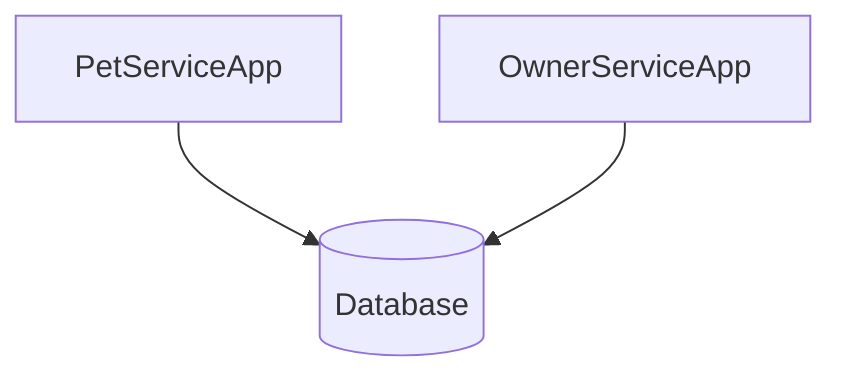
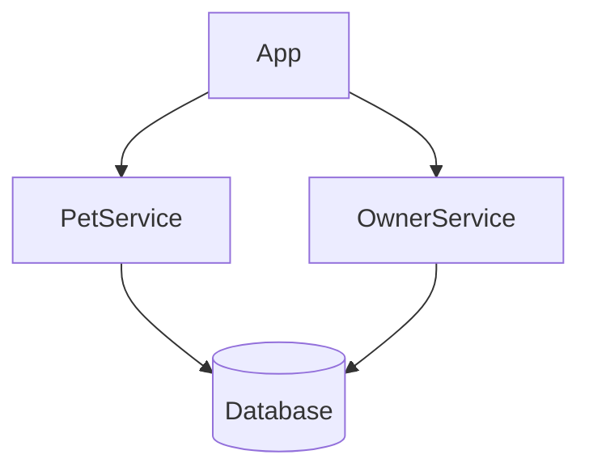

# Go Microservice Boilerplate

This boilerplate serves as a solid foundation for building robust, scalable, and maintainable microservice applications using the Go programming language.

### Microservice Architecture

Microservice architecture enhances scalability and flexibility in modern applications. A microservice boilerplate is a standardized template that streamlines development by providing essential components like directory structures, build tools, testing frameworks, and logging integrations. Using a boilerplate allows developers to focus on business logic, ensuring consistency and efficiency across services. This approach accelerates development, enforces standards, and reduces errors, facilitating robust and scalable software solutions.

> [!WARNING]
> Pet and owner were shown in the project only as an example.

### Aims of the Boilerplate

1. **Scalability**: While a monolithic application may not scale as easily as a microservice, this example provides best practices and patterns to help you scale your application efficiently as it grows.
2. **Ease of Deployment**: Application deployment and management become easier with a single deployable unit compared to a distributed microservices architecture.
3. **Enhance Scalability**: Allow individual services to scale independently based on demand.
4. **Increase Flexibility**: Enable developers to use different technologies and languages for different services.
5. **Improve Resilience**: Isolate failures to prevent them from affecting the entire system.
6. **Accelerate Development**: Allow multiple teams to work concurrently on different services, speeding up the development process.
Simplify Maintenance: Make it easier to update and maintain services due to their smaller and more focused nature.
1. **Promote Reusability**: Encourage the creation of reusable services that can be leveraged across different projects.
2. **Facilitate Deployment**: Support continuous delivery and deployment by enabling services to be deployed independently.

### Extras of the Boilerplate

How to use are [Swagger](https://github.com/gofiber/swagger), [Gorm](https://gorm.io/index.html) and [Gorm Gen](https://gorm.io/gen/) mentioned in the boilerplate.

### Why development mode working as monolithic ?
When go-air used for hot reload on separate applications in same time, it uses too much system features like memory. What's more, you may not even get any positive results from the work of the containers when the number of container is increased.

### Graph of the Production Structure


### Graph of the Development Structure


### Packages

-   [Fiber](https://github.com/gofiber/fiber)
-   [Fiber Swagger](https://github.com/gofiber/swagger)
-   [Uber FX](https://github.com/uber-go/fx)
-   [Uber Zap](https://github.com/uber-go/zap)
-   [Gorm](https://gorm.io/index.html)
-   [Gorm Gen](https://gorm.io/gen/)
-   [gRPC](https://grpc.io/docs/languages/go/quickstart/)

### Databases

-   [PostgreSQL](https://www.postgresql.org/)
  
### Proxy
- [Traefik](https://traefik.io/)

### Makefile Commands

Run the app as development mode

```bash
make dev
```

Run the app as production mode
```bash
make prod
```
Generate the swagger document
```bash
make swagger
```
Gorm Gen
```bash
make gorm
```
Generate client and server codes from proto
```bash
make proto
```
